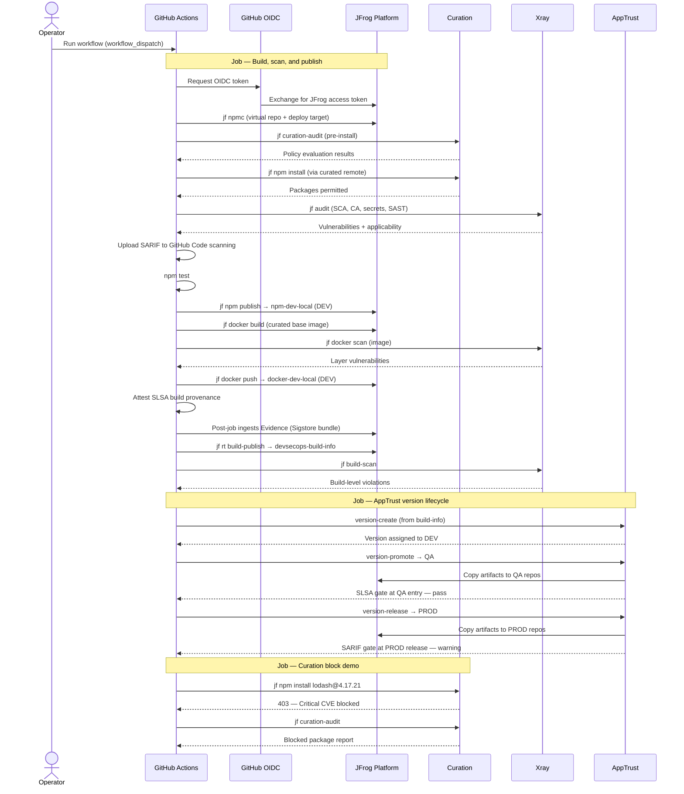

# DevSecOps Node API

A small Express service that ships as both an npm package and a Docker image. A GitHub Actions workflow on [tomjpd2.jfrog.io](https://tomjpd2.jfrog.io) builds it, scans it, publishes it to Artifactory, and promotes it through AppTrust lifecycle stages — all inside the **`devsecops`** JFrog Project.

The workflow is triggered manually (**Actions → DevSecOps Showcase → Run workflow**). It authenticates to JFrog via GitHub OIDC — no stored secrets.

## What the workflow does

Each run takes source code from this repository and produces two published artifacts:

| Artifact | Destination | Lifecycle stage |
|----------|-------------|-----------------|
| npm package `devsecops-node-api` | `devsecops-npm-dev-local` | DEV |
| Docker image `devsecops-node-api:<run>` | `devsecops-docker-dev-local` | DEV |

Both artifacts are captured in a single build-info record, assembled into an AppTrust application version, promoted to QA, and released to PROD.

Security and governance checks run throughout. In this demo configuration they **report findings but do not block** the run, so the full lifecycle always completes. Any gate can be switched to blocking mode in production use.

---

## Job 1: Build, scan, and publish

### Authenticate and configure

1. **Checkout** the repository.
2. **Authenticate to JFrog** via OIDC (`setup-jfrog-cli`). Every subsequent `jf` command runs in the context of the `devsecops` project.
3. **Verify connectivity** with `jf rt ping` and `jf apptrust ping`.
4. **Point npm at Artifactory** — dependencies resolve through `devsecops-npm-virtual`, which fronts a Curation-monitored remote (`devsecops-npm-remote`). Packages deploy to `devsecops-npm-dev-local`.

### Dependency governance and scanning

5. **Curation audit** (`jf curation-audit`) evaluates the declared dependency tree against Curation policies *before* anything is downloaded.
6. **Install dependencies** (`jf npm install`) through the curated virtual repository. Each package is evaluated by Curation at resolution time.
7. **Xray source audit** (`jf audit --sca --secrets --sast`) scans the project source. This includes:
   - **SCA** — known vulnerabilities in dependencies
   - **Contextual Analysis** — whether each vulnerability is actually reachable from the code (applicable vs. not applicable)
   - **Secrets detection** and **SAST**
8. **Export SARIF** and upload results to the GitHub **Code scanning** tab.

### Build and publish

9. **Run tests** (`npm test`) — the only step that hard-fails the workflow on error.
10. **Publish the npm package** (`jf npm publish`) to `devsecops-npm-dev-local`.
11. **Prune dev dependencies** so the Docker image carries production packages only.
12. **Build the Docker image** (`jf docker build`). The base image (`node:20-alpine`) resolves through `devsecops-docker-virtual`, which fronts a Curation-monitored Docker remote.
13. **Scan the image locally** (`jf docker scan`) — OS-layer vulnerabilities and secrets in container layers.
14. **Push the image** (`jf docker push`) to `devsecops-docker-dev-local`. The image and its layers are recorded in build-info.

### Provenance, build-info, and build scan

15. **Resolve the image digest** from Artifactory for the attestation subject.
16. **Attest SLSA build provenance** (`actions/attest-build-provenance`) bound to the OCI image. The `setup-jfrog-cli` post-job automatically ingests the Sigstore bundle as JFrog Evidence.
17. **Collect build environment** (`jf rt build-collect-env`) — CI runner metadata.
18. **Attach git metadata** (`jf rt build-add-git`) — commit SHA, branch, message.
19. **Publish build-info** (`jf rt build-publish`) to `devsecops-build-info`.
20. **Scan the published build** (`jf build-scan`) — Xray evaluates the full artifact graph (npm package + Docker image + dependencies).
21. **Verify build-info** is resolvable in the project-scoped repository before the release job starts.

---

## Job 2: AppTrust version lifecycle

Runs after the build job succeeds.

22. **Create an application version** (`jf apptrust version-create`) for application `devsecops-node-api`, sourcing the build-info from step 19. The version is auto-assigned to the **DEV** stage because all artifacts reside in DEV-mapped repositories.
23. **Promote to QA** (`jf apptrust version-promote … QA`) — artifacts are copied into QA-stage-mapped repositories. A Unified Policy gate at QA entry checks for **SLSA provenance evidence** on the Docker image (satisfied by step 16).
24. **Release to PROD** (`jf apptrust version-release`) — artifacts are copied into PROD-stage-mapped repositories. A Unified Policy gate at PROD release checks for **Xray SARIF evidence** (intentionally unsatisfied in this demo, producing a warning that does not block the release).

Gate results are written to the GitHub Actions job summary.

---

## Job 3: Curation block demonstration

Runs in parallel with the release job. Does not affect the overall workflow result.

25. Attempts to install `lodash@4.17.21` through the curated npm virtual repository. Curation blocks the package (Critical CVE) with a 403.
26. Runs `jf curation-audit` on the blocked dependency set to surface the policy decision in the log.

This job illustrates the one control that *is* genuinely blocking in this environment: Curation's platform-wide policies reject packages with Critical CVEs, malicious content, immature releases, or missing licenses.

---

## Sequence diagram



---

## Platform layout

All resources belong to the **`devsecops`** JFrog Project on `tomjpd2.jfrog.io`.

```
devsecops-npm-remote (curated)  ──┐
                                   ├── devsecops-npm-virtual  →  resolve
devsecops-npm-dev-local  (DEV)  ──┘
devsecops-npm-qa-local   (QA)
devsecops-npm-prod-local (PROD)

devsecops-docker-remote (curated) ──┐
                                     ├── devsecops-docker-virtual  →  base image
devsecops-docker-dev-local  (DEV)  ──┘
devsecops-docker-qa-local   (QA)
devsecops-docker-prod-local (PROD)

devsecops-build-info  →  build-info storage
devsecops-node-api    →  AppTrust application
```

Lifecycle stages: **DEV → QA → PROD** (promote through DEV and QA; release into PROD).

---

## Running the workflow

1. Open **Actions → DevSecOps Showcase → Run workflow**.
2. Optionally set `app_version` (SemVer). Defaults to `1.0.<run_number>`.
3. Three jobs run: **Build, scan, and publish**, **AppTrust version lifecycle**, and **Curation block demonstration**.

Required repository variables:

| Variable | Value |
|----------|-------|
| `JF_URL` | `https://tomjpd2.jfrog.io` |
| `JF_DOCKER_REGISTRY` | `tomjpd2.jfrog.io` |
| `JF_PROJECT` | `devsecops` |
| `JF_OIDC_PROVIDER` | `github-oidc-integration` |
| `JF_OIDC_AUDIENCE` | `jfrog-github` |

---

## What to look for after a run

| Where | What |
|-------|------|
| Artifactory → `devsecops-npm-dev-local` | Published npm package |
| Artifactory → `devsecops-docker-dev-local` | Docker image tagged with the run number |
| Artifactory → Builds → `devsecops-node-api` | Build-info with npm + Docker modules |
| Xray → Violations | Source audit and build scan findings |
| Xray → Contextual Analysis | Applicable vs. not-applicable vulnerability results |
| Evidence | SLSA provenance on the Docker image (ingested from GitHub attestation) |
| AppTrust → `devsecops-node-api` | Application version at PROD, promoted through QA |
| GitHub → Security → Code scanning | SARIF results from Xray source audit |
| GitHub → Actions job summary | AppTrust gate results from promote and release |
| Curation demo job log | 403 block on `lodash@4.17.21` |

---

## Application

A minimal Express API with three endpoints:

| Method | Path | Purpose |
|--------|------|---------|
| `GET` | `/healthz` | Health check with server timestamp |
| `POST` | `/config` | Parse a JSON5 configuration body |
| `GET` | `/releases?range=` | Validate a semver range from query parameters |

The dependency set is chosen so Xray Contextual Analysis produces both **applicable** findings (vulnerable functions called with user input) and **not applicable** findings (vulnerable library present but unreachable from the code).

---

## Gate posture in this demo

Every security gate is configured to observe and report, not block. This ensures the full lifecycle completes on every run.

| Gate | Behaviour in this demo | Production alternative |
|------|----------------------|----------------------|
| Curation (dependency download) | Blocks Critical/malicious packages at resolution | Same — this is the live control |
| Xray source audit | Reports findings, does not fail the step | `--fail=true` with a watch |
| Xray build scan | Reports findings, does not fail the step | `--fail=true` |
| Xray policy | Records violations, no download/build block | `fail_build: true` on the policy rule |
| AppTrust QA entry gate | Warning — SLSA provenance required | `mode: block` |
| AppTrust PROD release gate | Warning — Xray SARIF required (unsatisfied) | `mode: block` |

Curation is the exception: its platform-wide blocking policies are always active. The main build uses a dependency set that passes Curation; the separate demo job shows what happens when a blocked package is requested.
