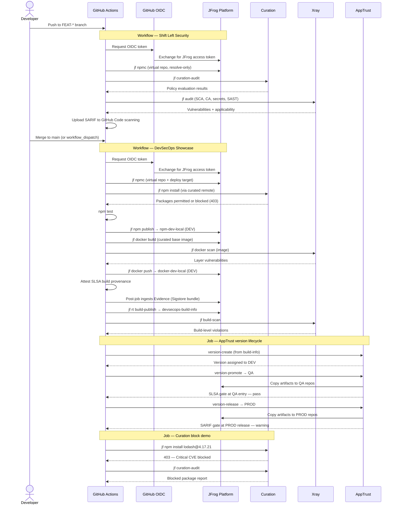

# DevSecOps Node API

A small Express service that ships as both an npm package and a Docker image. Two GitHub Actions workflows on [tomjpd2.jfrog.io](https://tomjpd2.jfrog.io) exercise the **`devsecops`** JFrog Project: one runs **shift-left security checks** on feature branches, the other **builds, publishes, and promotes** through AppTrust lifecycle stages on `main`.

Both workflows authenticate to JFrog via GitHub OIDC — no stored secrets.

## What the workflows do

### Shift Left Security (feature branches)

Runs on pushes to `FEAT-*` branches (for example `FEAT-12345`) and via **workflow_dispatch**. It evaluates dependency governance and source security **before** any build or publish step:

| Check | Command | Purpose |
|-------|---------|---------|
| Curation audit | `jf curation-audit` | Policy evaluation on the declared dependency tree |
| Xray source audit | `jf audit --sca --secrets --sast` | SCA, Contextual Analysis, secrets, and SAST |
| SARIF upload | `upload-sarif` | Findings in GitHub **Code scanning** |

No `node_modules`, Docker image, or build-info is required — both audits resolve from the committed `package-lock.json` and first-party source. A typical run completes in about one minute.

### DevSecOps Showcase (main)

Runs on pushes to `main` and via **workflow_dispatch**. Each run produces two published artifacts:

| Artifact | Destination | Lifecycle stage |
|----------|-------------|-----------------|
| npm package `devsecops-node-api` | `devsecops-npm-dev-local` | DEV |
| Docker image `devsecops-node-api:<run>` | `devsecops-docker-dev-local` | DEV |

Both artifacts are captured in a single build-info record, assembled into an AppTrust application version, promoted to QA, and released to PROD.

Security and governance checks run throughout. In this demo configuration they **report findings but do not block** the run, so the full lifecycle always completes. Any gate can be switched to blocking mode in production use.

---

## Why shift left

The release pipeline on `main` takes several minutes: install, test, publish, Docker build and scan, build-info, AppTrust promotion. That is the right place for **artifact-level** controls — image scans, build scans, provenance attestation, lifecycle gates.

Dependency governance and source-level security are different. They can run from a lockfile and source tree alone, with no build, no image, and no build-info. Moving `jf curation-audit` and `jf audit` to a feature-branch workflow means developers get feedback roughly one minute after they push, instead of waiting for the full release pipeline on merge.

| Feedback loop | Trigger | Typical duration | What you learn |
|---------------|---------|------------------|----------------|
| Shift Left Security | Push to `FEAT-*` | ~1 minute | Blocked packages, CVEs, secrets, SAST findings |
| DevSecOps Showcase | Push to `main` | ~4 minutes | Build correctness, image scan, build scan, lifecycle promotion |

Curation **enforcement** (the live 403 on blocked packages) still applies on `main` at `jf npm install`. The shift-left workflow adds an **earlier report** on the same policies.

For differential PR scanning, PR comments, and autofix, [Frogbot](https://docs.jfrog.com/security/docs/frogbot) is the next step up from running `jf audit` directly in a workflow.

---

## Shift Left Security job

1. **Checkout** the repository.
2. **Authenticate to JFrog** via OIDC (`setup-jfrog-cli`).
3. **Point npm at Artifactory** (resolve-only through `devsecops-npm-virtual`).
4. **Curation audit** (`jf curation-audit`) — observe-only in this lab.
5. **Xray source audit** (`jf audit --sca --secrets --sast`) — SCA, Contextual Analysis, secrets, SAST; observe-only.
6. **Export SARIF** and upload to GitHub **Code scanning** (category `jfrog-xray-shift-left`).

---

## DevSecOps Showcase — Job 1: Build, scan, and publish

### Authenticate and configure

1. **Checkout** the repository.
2. **Authenticate to JFrog** via OIDC (`setup-jfrog-cli`). Every subsequent `jf` command runs in the context of the `devsecops` project.
3. **Verify connectivity** with `jf rt ping` and `jf apptrust ping`.
4. **Point npm at Artifactory** — dependencies resolve through `devsecops-npm-virtual`, which fronts a Curation-monitored remote (`devsecops-npm-remote`). Packages deploy to `devsecops-npm-dev-local`.

### Dependency install and build

5. **Install dependencies** (`jf npm install`) through the curated virtual repository. Each package is evaluated by Curation at resolution time — this is the live enforcement control on `main`.
6. **Run tests** (`npm test`) — the only step that hard-fails the workflow on error.
7. **Publish the npm package** (`jf npm publish`) to `devsecops-npm-dev-local`.
8. **Prune dev dependencies** so the Docker image carries production packages only.
9. **Build the Docker image** (`jf docker build`). The base image (`node:20-alpine`) resolves through `devsecops-docker-virtual`, which fronts a Curation-monitored Docker remote.
10. **Scan the image locally** (`jf docker scan`) — OS-layer vulnerabilities and secrets in container layers.
11. **Push the image** (`jf docker push`) to `devsecops-docker-dev-local`. The image and its layers are recorded in build-info.

### Provenance, build-info, and build scan

12. **Resolve the image digest** for the SLSA attestation subject.
13. **Attest SLSA build provenance** (`actions/attest-build-provenance`) bound to the OCI image. The `setup-jfrog-cli` post-job automatically ingests the Sigstore bundle as JFrog Evidence.
14. **Collect build environment** (`jf rt build-collect-env`) — CI runner metadata.
15. **Attach git metadata** (`jf rt build-add-git`) — commit SHA, branch, message.
16. **Publish build-info** (`jf rt build-publish`) to `devsecops-build-info`.
17. **Scan the published build** (`jf build-scan`) — Xray evaluates the full artifact graph (npm package + Docker image + dependencies).
18. **Verify build-info** is resolvable in the project-scoped repository before the release job starts.

Source-level Xray audit (SCA, secrets, SAST) and Curation pre-install audit run on feature branches via **Shift Left Security**, not in this job.

---

## DevSecOps Showcase — Job 2: AppTrust version lifecycle

Runs after the build job succeeds.

19. **Create an application version** (`jf apptrust version-create`) for application `devsecops-node-api`, sourcing the build-info from step 16. The version is auto-assigned to the **DEV** stage because all artifacts reside in DEV-mapped repositories.
20. **Promote to QA** (`jf apptrust version-promote … QA`) — artifacts are copied into QA-stage-mapped repositories. A Unified Policy gate at QA entry checks for **SLSA provenance evidence** on the Docker image (satisfied by step 13).
21. **Release to PROD** (`jf apptrust version-release`) — artifacts are copied into PROD-stage-mapped repositories. A Unified Policy gate at PROD release checks for **Xray SARIF evidence** (intentionally unsatisfied in this demo, producing a warning that does not block the release).

Gate results are written to the GitHub Actions job summary.

---

## DevSecOps Showcase — Job 3: Curation block demonstration

Runs in parallel with the release job. Does not affect the overall workflow result.

22. Attempts to install `lodash@4.17.21` through the curated npm virtual repository. Curation blocks the package (Critical CVE) with a 403.
23. Runs `jf curation-audit` on the blocked dependency set to surface the policy decision in the log.

This job illustrates the one control that *is* genuinely blocking in this environment: Curation's platform-wide policies reject packages with Critical CVEs, malicious content, immature releases, or missing licenses.

---

## Sequence diagram



---

## Platform layout

All resources belong to the **`devsecops`** JFrog Project on `tomjpd2.jfrog.io`.

```
devsecops-npm-remote (curated)  ──┐
                                   ├── devsecops-npm-virtual  →  resolve
devsecops-npm-dev-local  (DEV)  ──┘
devsecops-npm-qa-local   (QA)
devsecops-npm-prod-local (PROD)

devsecops-docker-remote (curated) ──┐
                                     ├── devsecops-docker-virtual  →  base image
devsecops-docker-dev-local  (DEV)  ──┘
devsecops-docker-qa-local   (QA)
devsecops-docker-prod-local (PROD)

devsecops-build-info  →  build-info storage
devsecops-node-api    →  AppTrust application
```

Lifecycle stages: **DEV → QA → PROD** (promote through DEV and QA; release into PROD).

---

## Running the workflows

### Shift Left Security

1. Create or push to a branch matching `FEAT-*` (for example `FEAT-12345`).
2. Or open **Actions → Shift Left Security → Run workflow** (workflow file must exist on the default branch; select the feature branch ref in the dropdown).

### DevSecOps Showcase

1. Push to `main`, or open **Actions → DevSecOps Showcase → Run workflow**.
2. Optionally set `app_version` (SemVer). Defaults to `1.0.<run_number>`.
3. Three jobs run: **Build, scan, and publish**, **AppTrust version lifecycle**, and **Curation block demonstration**.

Required repository variables:

| Variable | Value |
|----------|-------|
| `JF_URL` | `https://tomjpd2.jfrog.io` |
| `JF_DOCKER_REGISTRY` | `tomjpd2.jfrog.io` |
| `JF_PROJECT` | `devsecops` |
| `JF_OIDC_PROVIDER` | `github-oidc-integration` |
| `JF_OIDC_AUDIENCE` | `jfrog-github` |

---

## What to look for after a run

| Where | What |
|-------|------|
| GitHub → Actions → **Shift Left Security** | Curation table and Xray findings on feature branches |
| GitHub → Security → Code scanning | SARIF from shift-left runs (category `jfrog-xray-shift-left`) |
| Artifactory → `devsecops-npm-dev-local` | Published npm package |
| Artifactory → `devsecops-docker-dev-local` | Docker image tagged with the run number |
| Artifactory → Builds → `devsecops-node-api` | Build-info with npm + Docker modules |
| Xray → Violations | Build scan findings (main pipeline) |
| Xray → Contextual Analysis | Applicable vs. not-applicable vulnerability results (shift-left and build scan) |
| Evidence | SLSA provenance on the Docker image (ingested from GitHub attestation) |
| AppTrust → `devsecops-node-api` | Application version at PROD, promoted through QA |
| GitHub → Actions job summary | AppTrust gate results from promote and release |
| Curation demo job log | 403 block on `lodash@4.17.21` |

---

## Application

A minimal Express API with three endpoints:

| Method | Path | Purpose |
|--------|------|---------|
| `GET` | `/healthz` | Health check with server timestamp |
| `POST` | `/config` | Parse a JSON5 configuration body |
| `GET` | `/releases?range=` | Validate a semver range from query parameters |

The dependency set is chosen so Xray Contextual Analysis produces both **applicable** findings (vulnerable functions called with user input) and **not applicable** findings (vulnerable library present but unreachable from the code).

---

## Gate posture in this demo

**Every policy violation, unmet security control, and failed gate in this lab is intentionally ignored so the pipeline always runs to completion.** Steps use `continue-on-error: true`, `--fail=false`, or warning-mode AppTrust gates. This is a **teaching artifact**, not a reference configuration for production.

In a real environment, **any one** of the following could be a legitimate hard stop. The pipeline would not proceed until the finding is remediated or a documented, time-bound exception (waiver) is approved:

| Control | What it catches | How to make it blocking in production |
|---------|-----------------|--------------------------------------|
| Curation (dependency download) | Critical CVEs, malicious packages, immature releases, missing licenses | Already blocking at resolution (403) — the live control |
| Curation audit (pre-install report) | Same policies, reported before download | Remove `continue-on-error` / `\|\| true`; fail the job on blocked packages |
| Xray source audit | SCA, Contextual Analysis, secrets, SAST | `jf audit --fail=true` with `--project` or `--watches` |
| Xray Docker image scan | OS-layer CVEs, secrets in container layers | `jf docker scan --fail=true` |
| Xray build scan | Violations across the full artifact graph | `jf build-scan --fail=true` |
| Xray policy (platform) | Policy-matched violations on indexed artifacts | `fail_build: true` on the policy rule |
| AppTrust QA entry gate | Missing SLSA provenance evidence | Unified Policy gate `mode: block` |
| AppTrust PROD release gate | Missing Xray SARIF evidence | Unified Policy gate `mode: block` |

When a control is blocking, the remediation path is to fix the finding (upgrade a dependency, remove a secret, patch the image). The alternative is a formal exception — for example a Curation waiver for a specific package version, or an AppTrust evidence waiver — with owner, expiry, and risk acceptance documented.

Curation enforcement at download time is the one control that is **always active** in this demo, regardless of observe-only settings elsewhere. The main build uses a dependency set that passes Curation; the separate demo job shows what happens when a blocked package is requested.
